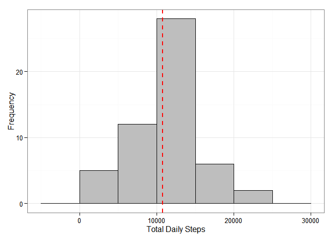
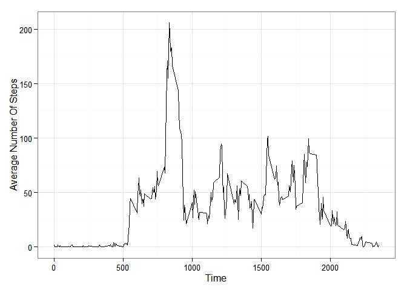

# Reproducible Research: Peer Assessment 1


## Loading and preprocessing the data

```r
#unzip and load the data into R
data <- read.csv(unz(filename = "activity.csv", description = "activity.zip"))
```

## What is mean total number of steps taken per day?


```r
library(ggplot2)
#summarise the data
summary <- aggregate(steps ~ date, data = data, sum)

#plot the data
ggplot(summary, aes(x = steps)) + 
  geom_histogram(binwidth = 5000, colour = "black", fill = "grey") +
  theme_bw() +
  geom_vline(aes(xintercept = mean(steps, na.rm = T)), colour = "red", linetype = "dashed", size = 1) +
  xlab("Total Daily Steps") +
  ylab("Frequency")
```

 


```r
#turn off scientific notation
options("scipen" = 100, "digits" = 0)
#calculate mean and median values
steps_mean <- mean(summary$steps, na.rm = T)
steps_median <- median(summary$steps, na.rm = T)
```

1. The **mean** total number of steps taken each day is 10,766  
2. The **median** total number of steps taken each day is 10,765

## What is the average daily activity pattern?
###Part 1

```r
 #aggregate the data by interval 
 summary_interval <- aggregate(steps ~ interval, data = data, mean)

 #plot the data
 ggplot(data = summary_interval, aes(x = interval, y = steps, group = 1)) + 
  geom_line() +
  xlab("Time") +
  ylab("Average Number Of Steps") +
  theme_bw()
```

 

###Part 2


```r
#find the internval with the highest average number of steps
top_interval <- summary_interval[summary_interval$steps == max(summary_interval$steps),1]
```

The time inverval is the **highest average number of steps** is 835


## Imputing missing values


## Are there differences in activity patterns between weekdays and weekends?
